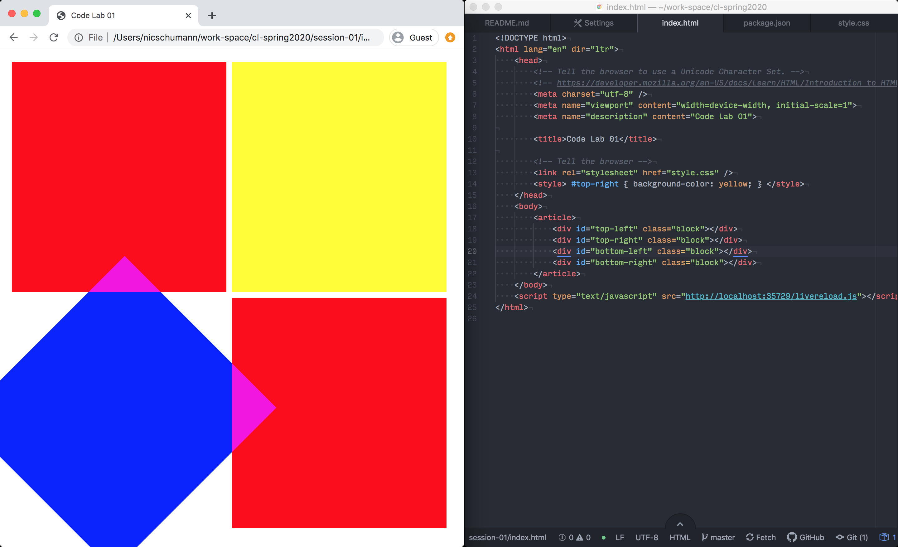
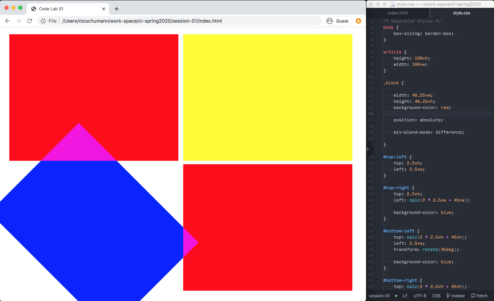
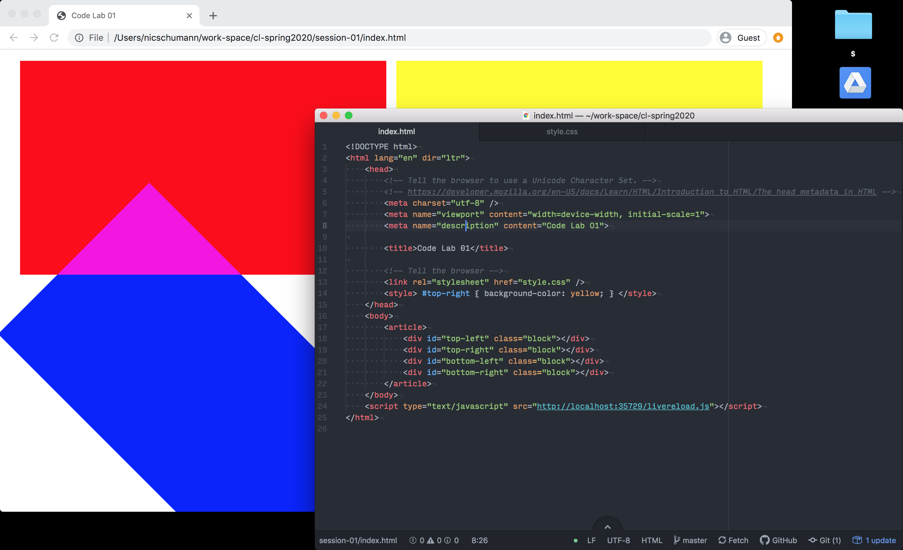
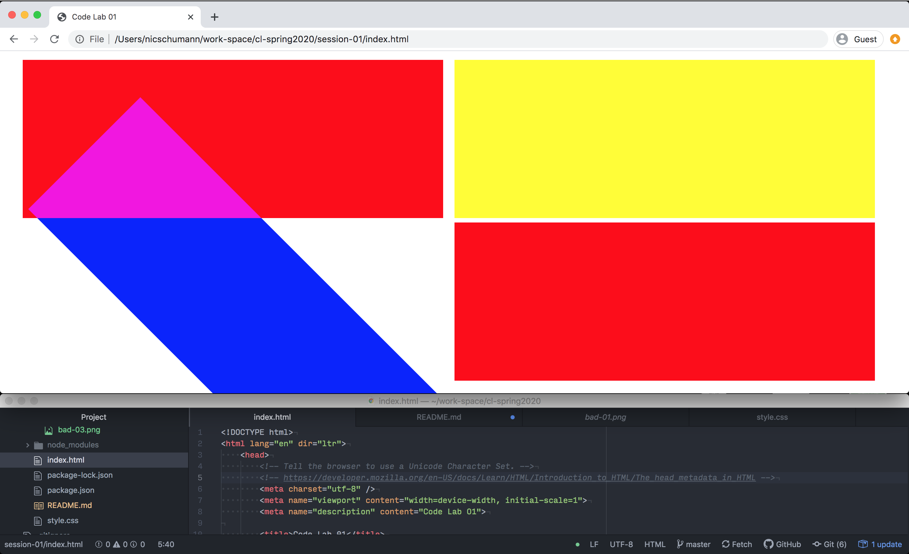
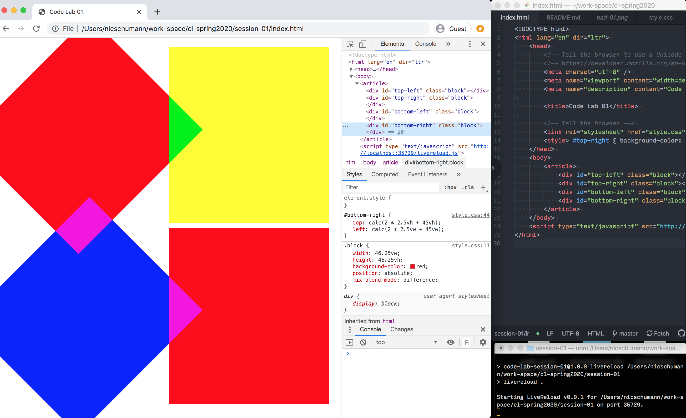
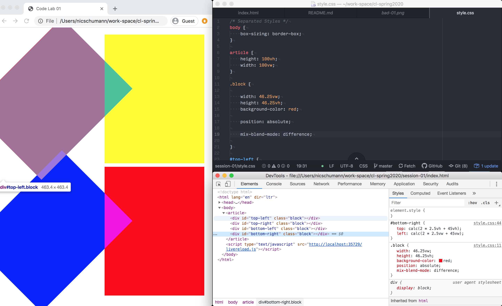
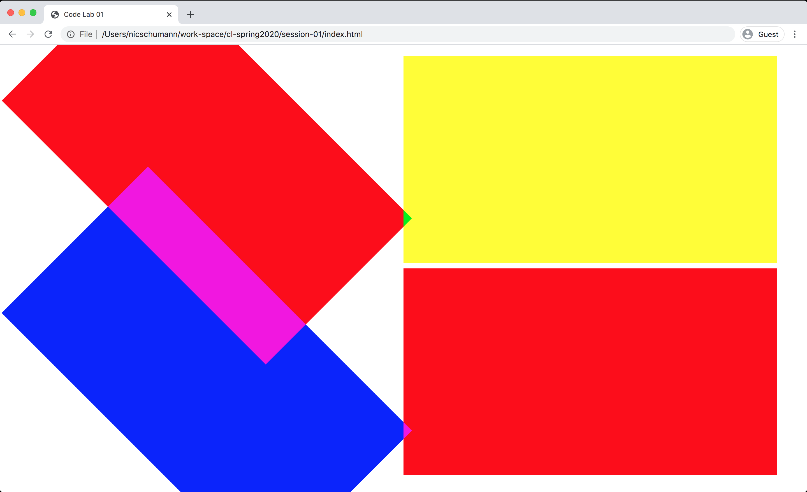

# Code Lab Session 1: Let's get organized.

Today's topics:

- **Getting Started**. How do I even open the files, and what program do I use, and how do I see the website?
- **Text editors**. How do I change the files?
- **HTML, CSS, & JS: How it all comes together.** What the heck do I put in the files so that the website shows up?
- **File and folder naming**. Where do the files live on my computer (paths), and how can I access them from my website (hyperlinks)?
- **CSS Cascading (css order and hierarchy)**. I don't like how the website looks by default. What are my options?
- **Supplemental: Development environment setup** All of this toggling between windows and hitting `⌘-R` is tiresome.


## Supplemental Material: Development Environments

_Note: This guide assumes you're using macOS._

A key to having a good time when you're making things is having a really tight loop between making a change and seeing the result. In development, this is really tough, because you're looking at files and text spread out in your text editor, and you're designing interactions and layouts spread out across the web. These two things don't look the same. Luckily, there are some things we can do to help.

### 1. A Clean Workspace, Part I

Design your workspace well, and account for the real estate that you have available on your screen. Everything you can do to minimize the distance between typing in the editor and seeing stuff on screen is good.

When you're building a website there are a few things that you need to see at a bare minimum.
- The website's current state
- The website's code. Maybe just whatever you're concentrating on at that moment – CSS for example – but maybe everything, if you're monitor's big enough.

Here are some very classic starting points.

50 / 50                 | 75 / 25
:----------------------:|:-----------------------:
 | 
A 50-50 split between  code and display is a good starting point | CSS has a shorter average line length, so when you're exclusively styling, a 75-25 split can work well.

Generally, a horizontal split doesn't work as well, because it forces the browser into an unusual, highly landscape proportion, which doesn't occur that frequently in normal browsing (there's a project in there, if someone wants it.)

Try to avoid:

Overlapping Windows  | Horizontal Split
:-------------------:|:----------------------------:
 | 
You'll just have to move them later. | Plus, text files with code are typically taller than they are wide.


### 2. Basic Order-of-Magnitude Analysis of Dead Time

Unlike InDesign, Illustrator, or Charcoal Drawing, when I make a change in my text editor, I can't really see what happened. To see what happened, I have to click over to my browser, which is hopefully nearby, and refresh the window. Then I see my change.

With a 50-50 window split, it takes me between 2 and 4 seconds to save my changes, refresh my browser, and see the changes. Here's the results of a very scientific study that I ran on my laptop with my iPhone timer.

Refresh 1 | Refresh 2 | Refresh 3 | Refresh 4 | Refresh 5 | Average Dead Time
:--------:|:---------:|:---------:|:---------:|:---------:|:------------:
4.08s     | 2.36s     | 3.06s     | 3.68s     | 2.09s     | **3.05s**

Doesn't seem so bad, but when I think about the fact that I probably make 5-7 changes to styling a minute, and I want to see them all as quickly as possible, you start to see things add up.

Dead Time / Change  | Changes / Minute | Dead Time / Minute
:----:|:---:|:-------------:
~3.05s | 5-7 | **15s – 21s**

In other words, for every minute you spend working on your projects, 1/4 – 1/3 of that time is dead, lost. On projects you might do, a lot of design work gets done right in the browser, and one of the best design strategies is trial and error. Don't loose 1/3 of your design time because you don't have the best tools. Even if you're doing a relatively short project (say just 15 hours of design and dev time), this time adds up. (And keep in mind that in industry, web projects can often take hundreds of hours, not tens.)

Dead Time / Minute  | Minutes / Project | Dead Time / Project
:----:|:---:|:-------------:
15s – 21s | 900m = **15h** * 60m/h | **3.75h** = 225m / 60m/h

Almost 4 hours of time spent reloading the page just so you can see what happened. Can we do better?

### 3. Turn Dead Time into Live Time with Livereload

Livereload is a software package that directly zeros-out the click-and-reload behavior. It's a `node.js` javascript package, meaning its written in Javascript and runs in the terminal on the `node` Javascript interpreter – the same environment that many other packages used in web and application development (which we may touch on in a subsequent lessons).

#### Installing Livereload

Installing livereload requires `node`. Using Livereload requires a little bit of terminal fluency, which you should start building up anyway. If you're comfortable, great. If not, today's a lovely day to start.

To start, open `Terminal.app`. Navigate to the directory containing this `README.md` file by opening the enclosing folder in `Finder`, dragging it into terminal, and hitting enter.

To check if you have `node` installed type

```sh
node --version
```

into the terminal. If you see something like

```sh
v8.11.1
```

that means you have it installed. Your numbers might be different, and that's okay. if you see something like

```sh
-bash: node: command not found
```

That means that that you do not have `node` installed. The next step deals with installing `node`, for those that don't have it.

Install `node`. This can be done through the project's website, [here](https://nodejs.org/en/). Download the latest stable supported version, which is the button on the left of this page. When you download it, open the package and follow the prompts to install it. Once the install has finished, exit your terminal, and restart it. If you run the `node --version` command, you should now see some numbers, which denote the version of Node.js you've just installed. Navigate back to this project directory, if you left.

From inside the project directory, run

```sh
npm install
```

This will download a few packages from an online repository of free Node.js software called NPM. Specifically, we're downloading a package called `livereload`, which allows us to update our CSS without needing to refresh our page. To start the livereload process, type

```sh
npm run livereload
```

This will start the livereload process in your terminal. A little code snippet inn the `index.html` file communicates with this process, and makes it so that our changes are automatically injected into the browser – no more `⌘-R`. That snippet looks like this:

```html
<script type="text/javascript" src="http://localhost:35729/livereload.js"></script>
```

It loads a script provided by our `livereload` process which monitors your computer for local changes.

### 4. Coda: Livereload and Atom

If you use the Atom text editor like I do, there's a plugin that wraps all of this functionality in a convenient bubble for you.

In atom, you can type `⌘-SHIFT-P` to bring up a command palette. Then type "Install Packages and Themes" to bring up the package manager. From there, you can type "livereload" and hit install to download the plugin.

Once you have it installed, `CTRL-SHIFT-R` toggles the server. After that, behavior is the same as the command line version. The plugin is really just a very think wrapper around the command line tool.

This plugin lets you avoid using the command line. However, I'd recommend getting used to the command line environment. It's an integral part of a web development workflow (even in 2020). Trying to get `node` and `livereload` going is a good way to start.


### 3. Gallery of Clean Workspaces

In many cases, just the text editor and browser  that's not enough. Sometimes you'll need:

- A debugging environment. For web work, this is usually the element inspector build into your browser.
- A terminal window, if you're running an build processes, local servers, using `git` at the command line, or any other stuff.

I'd highly encourage everyone to think about design their workspace. Like any other design or engineering task, setting things up in a way that's comfortable and fluid for you makes all the difference.


Two Column Layout    | Mini Terminal
:-------------------:|:----------------------------:
 | 
Sometimes it's nice to see html and CSS at the same time. | For when you don't really need the terminal much.

If you're occasionally in the terminal to run processes or use git, or run a Content Management System or server environment, you might use a two screen system.

Main Screen    | Second Screen
:-------------------:|:----------------------------:
 | 
The Main Screen handles primary development. | The second screen displays information about your background processes.

Or, if you have two monitors, you might have one for looking at, and one for interacting with. This is where livereload is really good.

Main Screen    | Second Screen
:-------------------:|:----------------------------:
 | 
The Main Screen provides the text editor and the inspector | The second screen displays the website.

The specifics of your setup will depend on you and your ergonomics. The point is to go through the work of designing it.

If you think of something that could help you work better; google it. Chances are someone else has had, and solved your problem. That's how I found `livereload` originally, and how I found the `livereload` plugin for atom while writing these notes.

All best.
